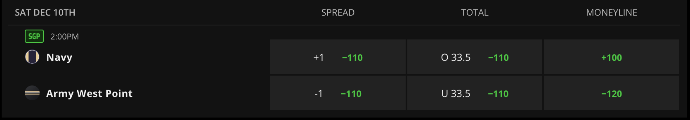
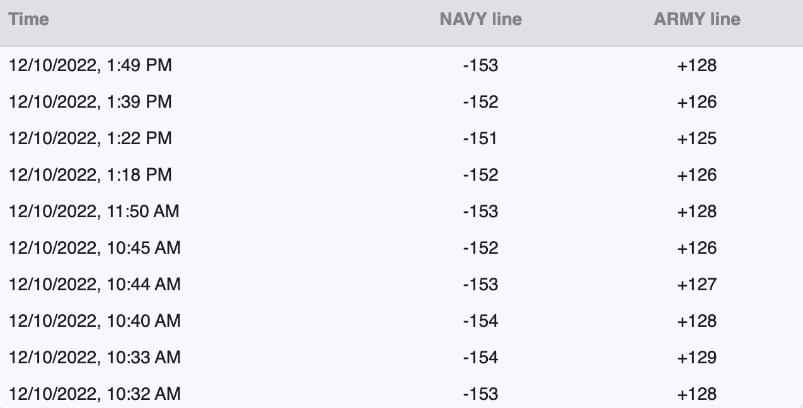
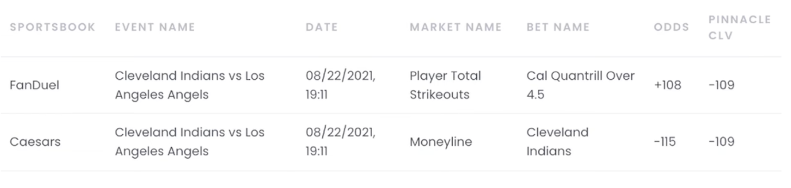

```{r setup, include=FALSE}
knitr::opts_chunk$set(echo = TRUE)
library(dplyr)
library(tidymodels)
library(tidyverse)
library(glmnet)
library(probably)
library(ggplot2)
library(sf)
library(maps)
library(plotly)
library(remotes)
```

## Introduction

For this project, we wanted to investigate ways in which someone could over time receive positive return from sports gambling, particularly in a way where we remove the biases of having sports knowledge and focusing solely on leveraging expected value. What originally began as a dead end project that just examined trends in college football gambling results was turned into something much more applicable when we met with an expert in the field named Alex Monahan, the co-founder of [OddsJam.com](oddsjam.com), a site that compiles game lines for all sports, and most importantly all books, to allow for arbitrage gambling to help a person select a line from the book with the best value possible, resulting in positive expected value over time. In addition to comparing between books, Monahan also used the movement of lines of a particular game as a way to track his success, checking the line he bet on against what the closing line was at game time to see if his bet had a better value than the closing line. Across his site Monahan has posted his own success from using his arbitrage strategies, posting earnings of $400,000, a value so good that we wanted to investigate his process. This paper will further discuss why lines move and how this impacts expected value gambling, along with creating predictive models for the five major U.S. sports, NFL, NCAA Football, MLB, NBA, and NHL which are devised to help a gambler decide which money lines are most likely to be more valuable than what they will close at.

## What is Sports Betting?

If a game is being played, people are going to bet on it. Humans have been gambling on sports since ancient times, but recent legislation in the United States has allowed sports betting to become legal in 30 states, with many other states in heated debates over legalizing it themselves as seen in the graphic below displaying which states have legalized sports betting through various platforms. Over $57.2 billion dollars were bet on U.S. licensed sportsbooks in 2021, and that does not take into account offshore websites used by those living in states where sports betting is not yet legal. 

```{r eval=FALSE, message=FALSE, include=FALSE}
library(albersusa)

us <- usa_composite()
us_map <- fortify(us, region="name")

legality = read.csv("legality_by_state.csv")
legality = legality %>%
  mutate(id = State,
         In.Person = ifelse(as.logical(Online) & as.logical(In.Person), 0, In.Person),
         not_legal = if_else(Online == 0 & In.Person == 0 & Pending == 0, 1, 0),
         ID = tolower(State),
         status = (Online + 2 * In.Person + 3 * Pending + 4 * not_legal),
         `Legal Status` = cut(status, breaks = c(0,1,2,3,4), labels = c("Online", "In Person Only", "Pending", "Not Legal")))


us_map = left_join(us_map, legality, by = "id")

us_map_betting = ggplot() +
  geom_map(data=us_map, map=us_map,
           aes(x=long, y=lat, map_id=id, fill = `Legal Status`),
           color = "white") + 
  ggthemes::theme_map() + 
  labs(title = "Sports Betting Legality By State")
  

save(us_map_betting, file = "Narrative_Graphics/us_map_betting")
```

```{r message=FALSE, echo=FALSE}
load("Narrative_Graphics/us_map_betting")
plot(us_map_betting)
```

As sports gambling becomes more prominent, data analysis and modeling has become a huge area of study as people try to make gambling profitable. All over social media, people who have developed models that have shown success (these people are known as "sharps"), look to sell their picks to the public or average betters, claiming that even with the cost of their picks users will still win enough to be profitable. Unfortunately, many of these sellers only claimed their sharp status with early luck off of a small sample size on their models and at the end of the day, when solely trying to predict winners and losers of a game the Vegas models tend to come out on top.

```{r eval=FALSE, message=FALSE, include=FALSE}
load("basic_betting_data/nba_raw.rdata")
nba_raw <- betting_df

nba_times = nba_raw %>% 
  select(c(id, start_time)) %>% 
  unique()
nba_times = nba_times %>% unique()
rm(nba_raw)

load("basic_betting_data/nhl_raw.rdata")
nhl_raw <- betting_df

nhl_times = nhl_raw %>%
  select(c(id, start_time)) %>%
  unique()
rm(nhl_raw)

load("basic_betting_data/nfl_raw.rdata")
nfl_raw <- betting_df

nfl_times = nfl_raw %>%
  select(c(id, start_time)) %>%
  unique()
rm(nfl_raw)

load("basic_betting_data/mlb_raw.rdata")
mlb_raw <- betting_df

mlb_times = mlb_raw %>%
  select(c(id, start_time)) %>%
  unique()
rm(mlb_raw)

load("basic_betting_data/ncaaf_raw.rdata")
ncaaf_raw <- betting_df

ncaaf_times = ncaaf_raw %>%
  select(c(id, start_time)) %>%
  unique()
rm(ncaaf_raw)

times = rbind(nhl_times, nba_times,  ncaaf_times, nfl_times, mlb_times)
save(times, file = "basic_betting_data/game_times.rdata")

load("basic_betting_data/nfl_ml_clean.rdata")
load("basic_betting_data/ncaaf_ml_clean.rdata")
load("basic_betting_data/mlb_ml_clean.rdata")
load("basic_betting_data/nba_ml_clean.rdata")
load("basic_betting_data/nhl_ml_clean.rdata")

all_sports_raw = rbind(mlb_ml, nba_ml,  nfl_ml, ncaaf_ml, nhl_ml)

all_sports_reliability_plot = all_sports_raw %>%
  group_by(league) %>%
  mutate(bins = cut_number(home_prob_fair, 5)) %>%
  ungroup() %>%
  group_by(league, bins) %>%
  summarise(x = mean(home_prob_fair), 
            y = mean(home_team_win)) %>%
  ggplot(aes(x=x, y=y, color=league)) +
  geom_abline(slope = 1, color = "black", lty = 2) +
  geom_point() +
  geom_line() +
  facet_wrap(~league) +
  theme_bw() +
  labs(title = "Predicted Home Win Probability Vs. True Win Probability", x = "Predicted Win Probability", y = "True Home Win Probability")

save(all_sports_reliability_plot, file = "Narrative_Graphics/all_sports_reliability_plot")

rm(nba_raw, nhl_raw, nfl_raw, mlb_raw, ncaaf_raw, all_sports_raw)
```

```{r message=FALSE, echo=FALSE}
load("Narrative_Graphics/all_sports_reliability_plot")
plot(all_sports_reliability_plot)
```

The graphic above displays a reliability plot for the last 5 full seasons of the MLB, NBA, NCAA Football, NFL, and NHL. The plots display the cumulative frequency of true wins on the y axis, and the average predicted win probabilities on the x axis. Reliability plots indicate how well calibrated predictions made by a model are. The reliability plot of a perfectly calibrated model, meaning a prediction with probability $p$ is correct $p * 100$ percent of the time, will be linear with slope equal to 1. Each plot is almost a straight line, with slight variations, which indicates how incredible sportsbooks are at predict the outcomes.

Most gamblers bet for fun. These are known as "square bettors". They make up the overwhelming majority of bettors and view gambling as a form of entertainment. Most "squares" do not expect to be making money in the long run, and accept the fact that "the house always wins." On the other hand, the "sharp bettors" are the ones trying to create models to surpass the success rates noticed above. This however, is incredibly difficult, and requires a deeply advanced understanding of statistics. Because of the amount of money being gambled daily, books employ incredibly intelligent statisticians to create the prediction models. To beat the books in this way requires beating a team of highly paid, educated, and intelligent data scientists which is impractical.

However, there are other ways that people claim can be profitable in the long run, which we will explore in this project. But before we get any deeper into our analysis, we should go over how sports betting actually works, and introduce some common terminology.

## How Sports Betting Works

Sports books offer many different ways to bet on sports, including bets on team outcomes, player stats, and even live bets which are updated lines that are produced as a game is being playes. Typically the most common types of bets are the team outcome bets which include straight bets, money line bets, and over/under bets. Straight bets refer to betting on a team to win or lose by a certain amount of points, known as the spread. A money line bet means the gambler picks a team to win straight up. An over/under bet is when a bettor gambles on the combined score being above or below a certain number. Over/under bets can also be applied to a singular team in the game, predicting how many points that team alone will score. For each of these bets, the book sets a probability in the form of a line. In the United States the probabilities are displayed through American odds, which come in the form of a number (known as a line) greater than or equal to 100, or less than or equal to -100. Positive values indicate that if a bettor bets $100, they will win the amount of the line plus their original bet. Negative values mean that a bettor has to bet the size of the line to win \$100 plus their original bet. 

<center>


</center>

Take this image, for example. It is a screen shot of an offering from one of the most used books in the U.S., DraftKings.com. It is for a college football game taking place on Saturday, December 10, 2022 between Navy and Army. The money line column is the easiest to understand. A $100 bet on Navy to win at +100 American odds would return \$100 in winnings plus the original \$100 bet, so \$200 in total. A \$120 bet on Army to win at -120 American odds would also win \$100, and return the orignal bet for a total of \$220. 

After understanding how American odds work, the other two columns are pretty straightforward. When betting on the spread, a positive value means that a bet on that team will push (get just the bet back) if the team loses by the spread and win if the team loses by less than the spread. Conversely, a negative value means that a team has to win by more than the spread to win the bet. DraftKings thinks that Army is a 1 point favorite and is offering a line of -110. This means a bet of $110 would win \$100 if Army wins by more than 1. If they win by 1, the original bet will be returned. Similarly, a bet on the total over (indicated by O 33.5 in the picture) means the bettor will win if the sum of the points scored by both teams is 34 or more (the .5 means that the bet cannot push), and a bet on the under means the bettor will win if the sum of the points is 33 or less. In addition, while not included in this image, there is often an option to bet on the total over for a specific team in the game, which is the same idea as the total in the graphic only it would rely only on the score of Army or Navy.

In football, the spread and the over / under bets are usually regarded as a 50 / 50 bet, however books usually price coinflips at -110 on each side. A line of -110 has an implied probability of 52.38% ($\frac{110}{110 + 100} * 100$), even though the true probability, also known as the "fair" probability should be .5 on each side ($\frac{.5238}{.5238 + .5238} * 100$) This means the sum of the two probabilities of the possible outcomes is 104.76%. The extra 4.76% is known as the "juice" or the "vig", and it is how the books make their profit. If Bettor A places a $110 bet on Navy at +1 and Bettor B places \$110 on Army -1, and Army wins by more than 1, DraftKings will pay \$100 to Bettor B, but collect \$110 from Bettor A, leaving the book with a \$10, or 4.76%, profit. This motivates DraftKings to try to keep equal dollar amounts of bets on each side, meaning that the company will change the spread or the line if there is an imbalance. 

### Implied and Fair Probability Formulas

Implied Probability : $\frac{-1 * \text{Negative American Odds}}{\text{-1 * Negatvie American Odds + 100}}$ or $\frac{100}{\text{ Positive American Odds + 100}}$

Fair Probability : $\text{Fair Probability}_1 =\frac{\text{implied probability}_1}{\text{implied probability}_1 + \text{implied probability}_2}$

## Moving Lines

Due to the "vig" previously discussed, the goal of any book is for at game time to have the distribution of bets from the public be equal on each side. When successful at this, books ensure that they will receive a 4.76% profit on the sum of all bets placed, allowing them to profit regardless of the actual result. Particularly in sports like football where game lines are posted a week in advance, this allows for a lot of time for variation.

<center>


</center>

Using the Army Navy game again as an example, we can notice how frequently the lines change. In the span of roughly three hours, the line was updated ten times, and while this short window shows very small variation in the lines, over the course of a week this can lead to opportunities for large differences in line values.

This variation leads to possible opportunity of maximizing line value if you can predict the direction a line will move.

## Using Closing Line Value as a Tool

Eventually, a game has to begin and the pre-game lines will no longer change, remaining at a final value known as the closing line value. In our meeting with Monahan, he mentioned his way of retroactively checking whether or not he made a successful bet as whether or not the line he bet on has a better value than the closing line.

<center>


</center>

For example, this is an example of the log Monahan keeps to track his success rate on his bets. In this, he uses the closing line for Pinnacle as his baseline bet, regardless of the book he is gambling on under the assumption that Pinnacle is the most accurate book available. The first bet was placed on total strikeouts for pitcher Cal Quantrill at over 4.5 (an example of a bet on individual player stats called a "prop bet") at a line of +108. At closing, Pinnacle valued this line at -109. This bet would be deemed as a successful bet for Monahan since the value of +108 is significantly better than -109.

On the other hand the second bet was places through Caesars on the money line of the game ata a value of -115, whereas Pinnacle closed as a better value of -109, deeming this as an unsuccessful bet for Monahan.

## Research Question

In the following analysis, we will attempt to model the movement of line data to predict which money lines in each of the five major U.S. sports are most likely to decrease in value at closing, giving insight into what lines will result in successful bets and allowing someone to use Closing Line Value as a proactive tool for gambling as opposed to the retroactive way Monahan has implemented it.